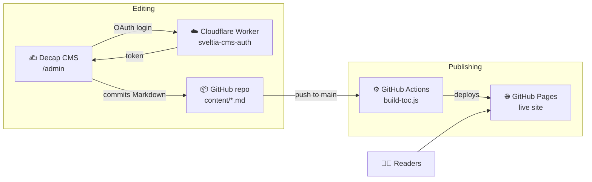

<div align="center">

# 🏛️ ISO 20022 Academy

**A course, not a reference.** Learn the language of modern payments — from how money
actually moves to reading and validating real ISO 20022 messages — through long-form
lessons that always start with a human problem, never a tag.

[](https://revanthrsai.github.io/ISO-20022-Academy/)
[](https://github.com/revanthrsai/ISO-20022-Academy/actions/workflows/pages.yml)
[](#-tech-stack)
[](https://decapcms.org)
[](LICENSE)

**[Visit the Academy →](https://revanthrsai.github.io/ISO-20022-Academy/)**

</div>

---

## ✨ What's inside

| Section | What it does | Route |
|---|---|---|
| 🎬 **The History** | Five cinematic chapters on how money messaging evolved — paper → telegrams → SWIFT MT → the ISO 20022 migration. Opens with a cinematic video hero. | `#/history/<chapter>` |
| 📚 **The Library** | Long-form lessons shelved by level (100 Fundamentals → 600 Field Guides), with knowledge checks, flow diagrams, and a persisted "mark as learned" toggle. | `#/library` |
| 🧪 **The Playground** | Five integrated tools sharing one message hand-off: XML Viewer, MT ⇄ MX Transformer, Validator, Comparator, Sample Library. | `#/playground/<tool>` |
| 🔍 **The Glossary** | 87 searchable, category-filtered payment terms, cross-linked into the Library and Playground. | `#/glossary` |

## 🏗️ Architecture

Zero frameworks, zero build dependencies, zero hosting bills. The whole stack is
static files on GitHub Pages, with content managed through Decap CMS and a tiny
Cloudflare Worker handling the GitHub login handshake.



**How a lesson goes live:** write in the CMS → editorial workflow (Draft → In Review → Ready)
→ Publish commits the Markdown to `content/` → GitHub Actions regenerates the Library
index (`toc.data.js`) and redeploys Pages. No servers, no databases, nothing to pay for.

## 🚀 Running locally

```bash
git clone https://github.com/revanthrsai/ISO-20022-Academy.git
cd ISO-20022-Academy
# open index.html in a browser — that's it, no install, no build step
```

Added articles locally? Refresh the Library index with:

```bash
node scripts/build-toc.js
```

## 🛠️ Tech stack

- **Frontend** — pure HTML, CSS, and vanilla JavaScript. Dark luxury fintech aesthetic
  (emerald `#10B981` palette) built entirely on CSS custom properties; hash-based SPA
  routing; motion system gated behind `prefers-reduced-motion`.
- **Content** — Markdown + YAML frontmatter in `content/`, rendered client-side by a
  custom lesson engine (`markdown.js`) with `{{embed}}`, `{{check}}` and `{{flow}}` tokens.
- **CMS** — [Decap CMS](https://decapcms.org) with the GitHub backend; auth via a free
  [sveltia-cms-auth](https://github.com/sveltia/sveltia-cms-auth) Cloudflare Worker.
- **Hosting & CI** — GitHub Pages, deployed by `.github/workflows/pages.yml` (bypasses
  Jekyll, regenerates the TOC on every push).

## 📁 File structure

```
index.html                 page shell: header/nav, content container, script includes
content/*.md               the Library lessons (frontmatter + Markdown + tokens)
admin/                     Decap CMS (config.yml + entry page) — publish at /admin
scripts/build-toc.js       generates assets/js/toc.data.js from content/ frontmatter
.github/workflows/         GitHub Pages deploy + TOC build (CI)
assets/css/style.css       all styling; :root is the design-token source of truth
assets/js/app.js           routing (hash), page templates, History chapters
assets/js/toc.js           Library shelf definitions + lookup helpers
assets/js/toc.data.js      GENERATED article registry — do not edit by hand
assets/js/markdown.js      lesson engine: frontmatter, Markdown, embed/check/flow tokens
assets/js/flow-diagram.js  business-terms flow diagram component
assets/js/data.js          glossary terms + Progress store (localStorage)
assets/js/ui.js            glossary rendering, detail panel, theme toggle
assets/js/xml-viewer.js    Playground: XML tree viewer
assets/js/transformer.js   Playground: MT ⇄ MX transformer
assets/js/validator.js     Playground: message validator
assets/js/comparator.js    Playground: message comparator
assets/js/samples.js       Playground: sample message library
assets/js/motion.js        motion design system (reduced-motion gated)
assets/js/preloader.js     one-time intro animation
docs/HANDBOOK.md           THE project doc: vision, IA, design system, authoring guide
```

## 📖 Documentation

Everything lives in one curated file: **[`docs/HANDBOOK.md`](docs/HANDBOOK.md)**.
Writing an article? Jump straight to §6 (Authoring & Publishing).

## 🗺️ Roadmap

This project is under active development — the Library is growing shelf by shelf.
Found it useful, spotted an error, or want a topic covered? Open an issue or reach out.

## 📄 License

Released under the [MIT License](LICENSE) — free to use, copy, and adapt with attribution.

<div align="center">
<sub>Built with ☕ and vanilla JS by <a href="https://github.com/revanthrsai">Revanth</a></sub>
</div>
