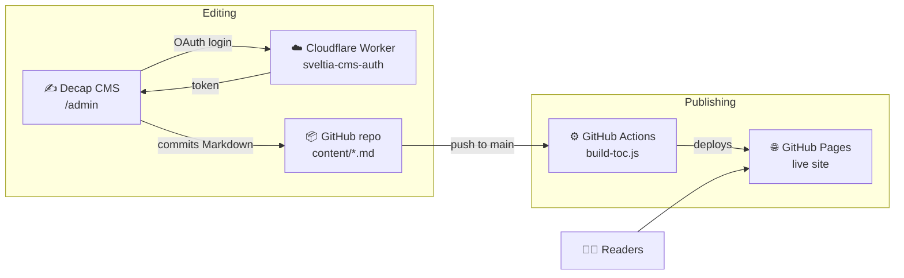

<div align="center">

# 🏛️ ISO 20022 Academy

**A course, not a reference.** Learn the language of modern payments — from how money
actually moves to reading and validating real ISO 20022 messages — through long-form
lessons that always start with a human problem, never a tag.

[](https://iso20022academy.in/)
[](https://github.com/revanthrsai/ISO-20022-Academy/actions/workflows/pages.yml)
[](#-tech-stack)
[](https://decapcms.org)
[](LICENSE)

**[Visit the Academy →](https://iso20022academy.in/)**

</div>

---

## ✨ What's inside

| Section | What it does | Route |
|---|---|---|
| 🎬 **The History** | Five cinematic chapters on how money messaging evolved — paper → telegrams → SWIFT MT → the ISO 20022 migration. Opens with a cinematic video hero. | `#/history/<chapter>` |
| 📚 **The Library** | Long-form lessons shelved by level (100 Fundamentals → 600 Field Guides), with knowledge checks, flow diagrams, and a persisted "mark as learned" toggle. | `#/library` |
| 🧪 **The Playground** | Five integrated tools sharing one message hand-off: XML Viewer, MT ⇄ MX Transformer, Validator, Comparator, Sample Library. | `#/playground/<tool>` |
| 🔍 **The Glossary** | 87 searchable, category-filtered payment terms, cross-linked into the Library and Playground. | `#/glossary` |

## 🏗️ Architecture

Zero frameworks, zero build dependencies, zero hosting bills. The whole stack is
static files on GitHub Pages, with content managed through Decap CMS and a tiny
Cloudflare Worker handling the GitHub login handshake.



**How a lesson goes live:** write in the CMS → editorial workflow (Draft → In Review → Ready)
→ Publish commits the Markdown to `content/` → GitHub Actions regenerates the Library
index (`toc.data.js`) and redeploys Pages. No servers, no databases, nothing to pay for.

## 🚀 Running locally

```bash
git clone https://github.com/revanthrsai/ISO-20022-Academy.git
cd ISO-20022-Academy
# open index.html in a browser — that's it, no install, no build step
```

Added articles locally? Refresh the Library index with:

```bash
node scripts/build-toc.js
```

## 🛠️ Tech stack

- **Frontend** — pure HTML, CSS, and vanilla JavaScript. Dark luxury fintech aesthetic
  (emerald `#10B981` palette) built entirely on CSS custom properties; hash-based SPA
  routing; motion system gated behind `